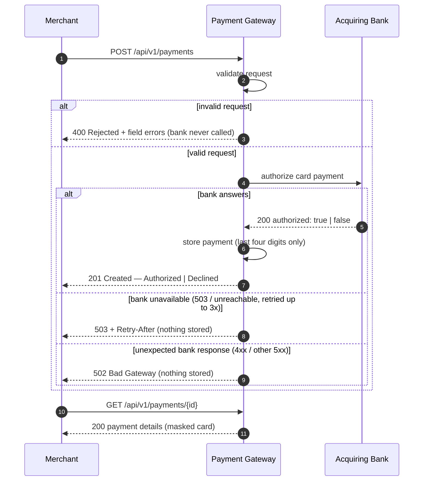

# Payment Gateway

A payment gateway API that lets a merchant process card payments through an acquiring bank and
retrieve them later — the [Checkout.com engineering challenge](https://github.com/cko-recruitment/).

```
Merchant ──HTTP──▶ Payment Gateway ──HTTP──▶ Acquiring Bank (simulator)
                   validate → authorize → store → respond
```

## Requirements

- JDK 17
- Docker (for the bank simulator and the optional end-to-end tests)

## Running

```bash
docker compose up -d        # 1. start the bank simulator (port 8080)
./gradlew bootRun           # 2. start the gateway (port 8090)
```

- Swagger UI: http://localhost:8090/swagger-ui/index.html (full API reference with valid examples)
- Health: http://localhost:8090/actuator/health

> Gradle must run on JDK 17–24. If your default `java` is newer:
> `JAVA_HOME=$(/usr/libexec/java_home -v 17) ./gradlew bootRun` (macOS).
> If port 8090 is taken by something else, free it first — the port is part of the challenge setup.

## Testing

```bash
./gradlew test       # unit, slice and integration tests — no Docker needed
./gradlew e2eTest    # end-to-end tests against the real bank simulator — needs Docker
```

The e2e tests start the challenge's own Mountebank simulator via Testcontainers, so `build` stays
hermetic and CI can run the two suites as separate jobs (see `.github/workflows/build.yml`).

| Layer | Tooling | Covers |
|---|---|---|
| Unit | JUnit 5 + AssertJ | validator rules (fixed clock), repository, DTO masking, idempotency store incl. concurrency |
| Web slice | `@WebMvcTest` | the HTTP contract: full validation matrix, status codes, error bodies |
| Integration | `@SpringBootTest`, bank scripted with `MockRestServiceServer` | real flows: round trips, retry counts, idempotency, no-card-data guarantee |
| End-to-end | Testcontainers + Mountebank | the real wire contract with the bank |

The bank is the only thing ever faked; each behaviour is asserted at exactly one layer.

## API

| Method | Path | Success | Errors |
|---|---|---|---|
| `POST` | `/api/v1/payments` | `201 Created` + `Location` | `400` rejected, `422` idempotency conflict, `502` bank contract error, `503` bank unavailable |
| `GET` | `/api/v1/payments/{id}` | `200 OK` | `400` invalid id, `404` unknown id |

### Process a payment

```bash
curl -X POST localhost:8090/api/v1/payments -H 'Content-Type: application/json' -d '{
  "card_number": "2222405343248871",
  "expiry_month": 4,
  "expiry_year": 2030,
  "currency": "GBP",
  "amount": 1050,
  "cvv": "123"
}'
```

```json
HTTP/1.1 201 Created
Location: http://localhost:8090/api/v1/payments/6f1c0a3e-...
{
  "id": "6f1c0a3e-...",
  "status": "Authorized",
  "card_number_last_four": "8871",
  "expiry_month": 4,
  "expiry_year": 2030,
  "currency": "GBP",
  "amount": 1050
}
```

A payment that the bank **declines** is still `201 Created` with `"status": "Declined"` — the
resource was created; the bank's decision is data, not an HTTP failure.

### Payment flow



**Test cards** (the simulator decides by the last digit): odd → `Authorized`, even → `Declined`,
`0` → bank unavailable (gateway returns `503`).

### Rejected requests

Invalid input is rejected **without calling the bank** — no payment is created, no id issued:

```json
HTTP/1.1 400 Bad Request
{
  "status": "Rejected",
  "message": "Payment request rejected",
  "errors": [
    { "field": "card_number", "message": "must be 14-19 digits" },
    { "field": "expiry_year", "message": "card has expired" }
  ]
}
```

### Validation rules

| Field | Rules |
|---|---|
| `card_number` | required, 14–19 digits (no spaces or separators) |
| `expiry_month` | required, 1–12 |
| `expiry_year` | required, 4-digit year; month + year must not be in the past (a card is valid through the last day of its expiry month, UTC) |
| `currency` | required, 3 characters, uppercase; supported: `EUR`, `GBP`, `USD` (configurable) |
| `amount` | required, integer > 0, in the **minor** currency unit (1050 = £10.50) |
| `cvv` | required, 3–4 digits |

Every invalid field is reported once, keyed by the JSON name the client sent.

### Idempotency

`POST` accepts an optional `Idempotency-Key` header (letters, digits, `-`, `_`, max 255 chars).
Repeating a request with the same key returns the payment created by the first request — the bank
is charged **at most once per key**, even for concurrent duplicates. The response carries
`Idempotent-Replayed: true|false`. Reusing a key with a *different* request returns `422`; a failed
attempt frees the key so the merchant can retry.

Limitations (deliberate for this exercise): the store is in-memory, single-node and unbounded.

## Bank failures

The spec leaves the bank-unavailable case undefined; this gateway's policy:

| Bank behaviour | Gateway response | Retried? |
|---|---|---|
| `503` | `503` + `Retry-After: 30`, nothing stored | yes, up to 3 attempts (200 ms back-off) |
| unreachable (connection refused/connect timeout) | `503` + `Retry-After: 30` | yes — the request provably never reached the bank |
| **read timeout** (request sent, no answer) | `503` + `Retry-After: 30` | **never** — the bank may already have authorized; retrying could charge the card twice |
| any other status (`400`, other `5xx`) | `502 Bad Gateway` | never — a contract error will not fix itself |

Nothing is persisted on failure: no authorization exists, so no payment resource exists. Retries
are implemented with Resilience4j (`resilience4j.retry.*` in `application.yml`).

## Sensitive data

- The full card number is accepted, forwarded to the bank, and then dropped: only the **last four
  digits** (as a string, preserving leading zeros) are stored and returned.
- The CVV is never stored, logged or returned.
- Request objects mask card data in `toString()`; validation errors never echo submitted values;
  the idempotency fingerprint uses last-four + expiry + currency + amount, never the PAN or CVV.
- Tests assert that card data appears in no response body.

## Observability

- Every log line follows one shape — `"<Event>: key={}, key={}"` — and carries `traceId`/`spanId`
  (Micrometer Tracing); the same trace id is propagated to the bank call via W3C `traceparent`.
- Actuator: `/actuator/health`, `/actuator/info` (build version), `/actuator/metrics`
  (HTTP server/client latencies, retry counters, JVM).
- In this exercise the actuator endpoints are unauthenticated.

## Design notes

- **Architecture:** controller (HTTP boundary) → service (orchestration) → bank client and
  in-memory repository. DTOs and the domain model are Java records; mapping is two static
  factories — no mapper framework, no interfaces with a single implementation.
- **Validation:** standard Bean Validation for per-field format rules; a plain
  `PaymentRequestValidator` component for business rules (supported currency, expiry in the
  future) — no custom constraint annotations. "Now" comes from an injected `Clock`, so expiry
  logic is deterministic to test.
- **Bank client:** `RestClient` with declarative `onStatus` handling; failures are classified into
  *unavailable* (retryable) vs *contract error* (not) — the classification drives both the retry
  policy and the HTTP mapping.
- **Storage:** the in-memory repository the challenge provides, made thread-safe
  (`ConcurrentHashMap`) and storing a domain `Payment` (which holds the bank's authorization code
  without ever exposing it).
- **Upgrades:** the starter's Spring Boot 3.1 (end-of-life) was upgraded to 3.5; Java stays 17 as
  the challenge requires.

### Assumptions

- **Rejected ≠ Declined.** *Rejected* means the gateway refused an invalid request: the bank was
  never called, no payment exists, nothing is retrievable (the spec's payment statuses are only
  `Authorized`/`Declined`). *Declined* means the bank said no to a valid request: a payment is
  created with status `Declined`, stored, and retrievable — reconciliation needs it.
- Currency codes are strict uppercase; no more than three currencies are supported, per the spec.
- `amount` is a 64-bit integer in minor units, in line with real payment APIs.
- No card-scheme (Luhn) validation: the spec doesn't ask for it and the simulator's test cards are
  not guaranteed Luhn-valid.
- No merchant authentication: the spec has no merchant identity concept.

## Future improvements

Each item was considered and deliberately left out; the table records what it would add and why it
doesn't belong in this exercise:

| Area | Improvement | Why not now |
|---|---|---|
| Storage | Replace the in-memory repository with a database; a unique constraint on the idempotency key then also removes the store's single-node and fingerprint-collision limitations | The spec explicitly allows the provided in-memory test double; a database adds setup burden for reviewers without changing any gateway behaviour |
| Caching | Cache payment lookups (`@Cacheable` on GET-by-id — payments are immutable, so entries never go stale) | Only meaningful once storage is a database; today the store *is* memory, so a cache would just duplicate it |
| Resilience | Circuit breaker on the bank client — retry absorbs brief blips; a breaker fails fast during sustained outages instead of hammering a dead bank (same Resilience4j library) | ~8 tuning parameters and stateful test behaviour for a single downstream; bounded retries + short timeouts already contain the failure at this scale |
| Security | Merchant authentication and per-merchant idempotency-key scoping; actuator behind a management port with auth | The spec has no merchant identity concept; adding auth would invent requirements |
| Observability | Export metrics to Prometheus/Grafana (`micrometer-registry-prometheus`, one dependency); export traces via OTLP/Zipkin | The app already exposes metrics and creates trace ids; collecting and visualising them is the platform's job, not the application's |
| Audit | Persist failed payment attempts for reconciliation and support | Correctly, no *payment* exists on failure; an attempts log is a separate concern needing its own storage |
| Platform | Spring Boot 4.x / a newer Java LTS | Boot was upgraded 3.1→3.5 to leave an end-of-life line with a two-line diff; 4.x is a planned migration (Jackson 3 packages, restructured starters, third-party matrix) with no functional gain here — and the brief fixes JDK 17 |